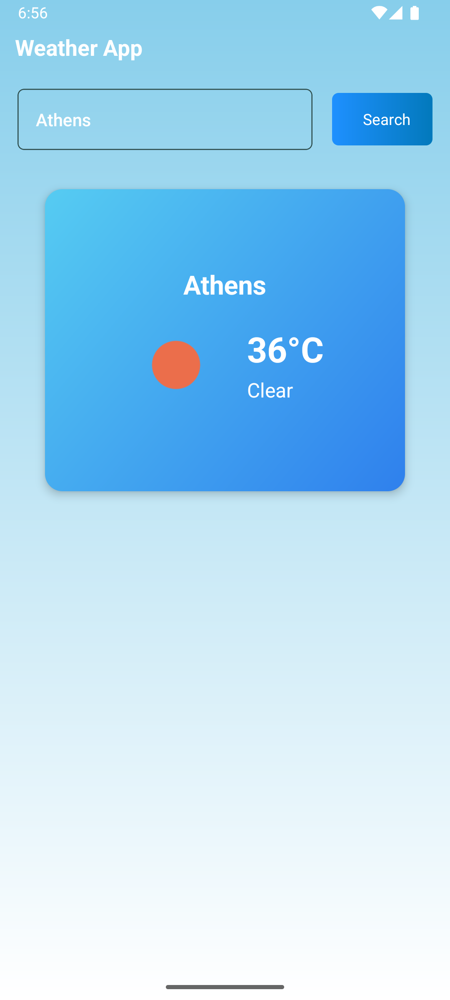
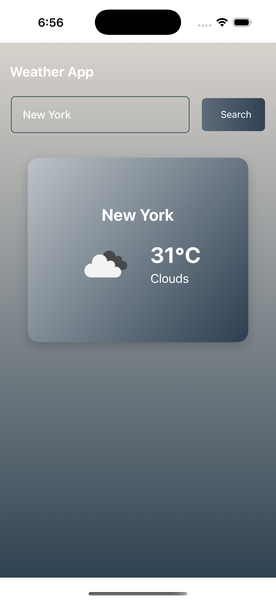

# 🌤️ Weather Forecast App

A beautifully designed, cross-platform **React Native** app that delivers **real-time weather data** using the OpenWeatherMap API. Built using the **MVVM architecture**, the app features **adaptive theming** (sunny, rainy, cloudy), **offline storage**, and providing a smooth and responsive user experience on both **iOS** and **Android** devices.

---

## 📸 Screenshots




---

## 🛠️ Tech Stack

| Category        | Tech Used                                  |
|-----------------|---------------------------------------------|
| Language        | TypeScript                                  |
| Framework       | React Native (CLI)                          |
| Architecture    | MVVM (Model-View-ViewModel)                 |
| State Management| React Context or Redux (depending on setup) |
| API             | [OpenWeatherMap](https://openweathermap.org/api) |
| Styling         | StyleSheet + Dynamic gradients              |
| Theming         | Light/Dark mode, weather-based background   |
| Testing         | Jest + @testing-library/react-native        |
| Storage         | Context API, AsyncStorage (for offline caching)          |

---

## 🚀 Getting Started

### ✅ Prerequisites

- Node.js (v16+ recommended)
- React Native CLI
- Xcode (for iOS development)
- Android Studio (for Android development)
- OpenWeatherMap API key

---

### 📦 Installation

```bash
git clone https://github.com/your-username/weather-app.git
cd weather-app
npm install
cd ios && pod install && cd ..
npx react-native run-android
# or
npx react-native run-ios
