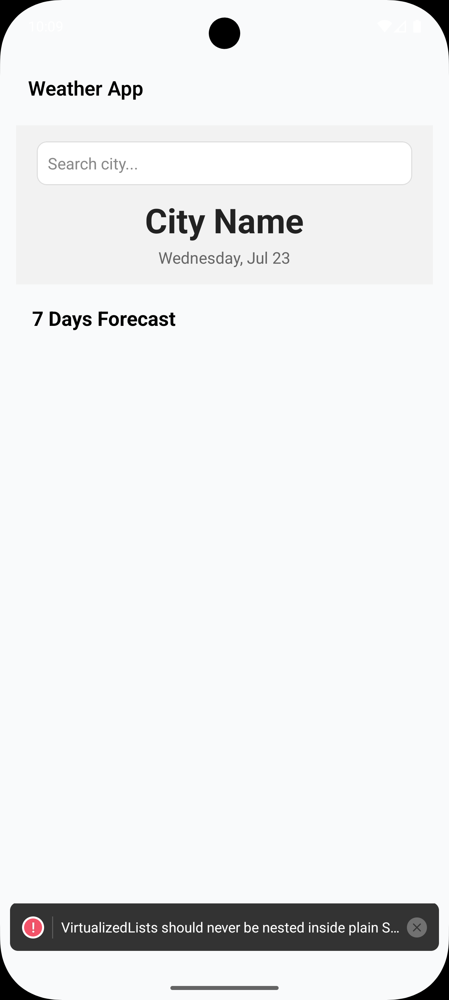
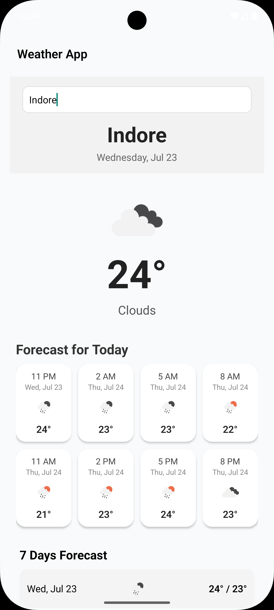
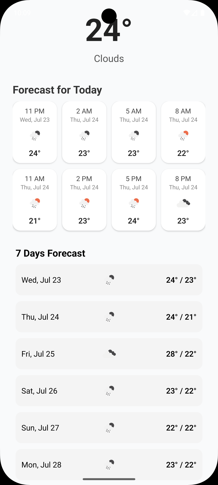

# 🌤️ Weather Forecast App

A beautifully designed, cross-platform **React Native** app that delivers **real-time weather data** using the **OpenWeatherMap API**. Built using the **MVVM architecture**, the app features:

- 🌈 Adaptive theming (sunny, rainy, cloudy)
- 💾 Offline data caching using AsyncStorage
- ⚡ Smooth and responsive experience on both **iOS** and **Android**

---

## 📸 Screenshots

### Android





---

## 🛠️ Tech Stack

| Category         | Tech Used                                       |
|------------------|--------------------------------------------------|
| Language         | TypeScript                                       |
| Framework        | React Native (CLI)                               |
| Architecture     | MVVM (Model-View-ViewModel)                      |
| State Management | React Context (or Redux if preferred)            |
| API              | [OpenWeatherMap](https://openweathermap.org/api)|
| Styling          | StyleSheet + Weather-based gradients             |
| Theming          | Light/Dark mode + Weather-based backgrounds      |
| Testing          | Jest + @testing-library/react-native             |
| Storage          | AsyncStorage (Offline caching)                   |

---

## 🚀 Getting Started

### ✅ Prerequisites

- Node.js (v16+ recommended)
- React Native CLI
- Xcode (for iOS)
- Android Studio (for Android)
- OpenWeatherMap API Key

---

### 📦 Installation

```bash
# Clone the repo
git clone https://github.com/your-username/weather-app.git
cd weather-app

# Install dependencies
npm install

# iOS: install CocoaPods
cd ios && pod install && cd ..

# Run the app
npx react-native run-android
# or
npx react-native run-ios


src/
├── components/         # UI components
├── context/            # Weather context and provider
├── hooks/              # Custom hooks
├── services/           # API logic
├── screens/            # Main app screens
├── styles/             # Themed styles
├── utils/              # Helper functions
└── App.tsx             # Entry point
